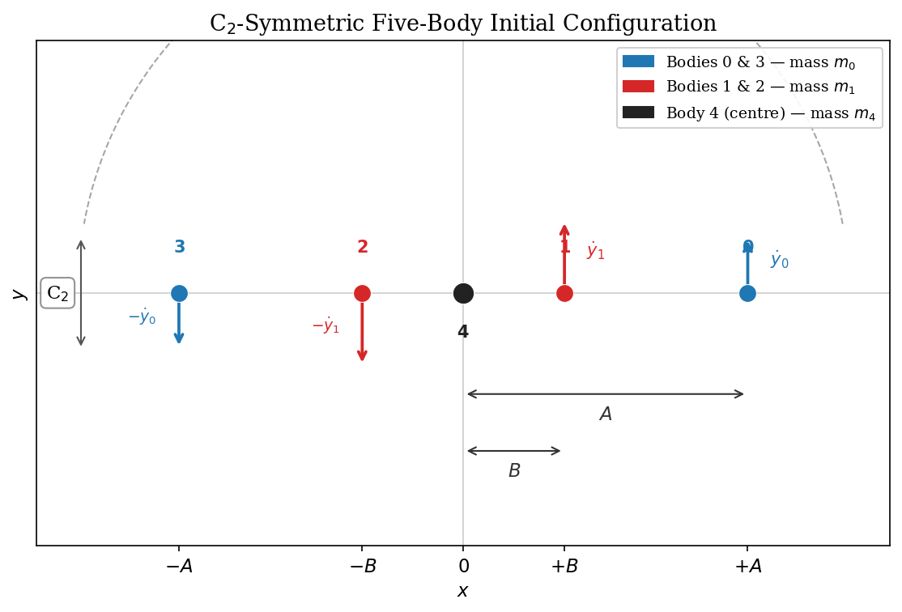
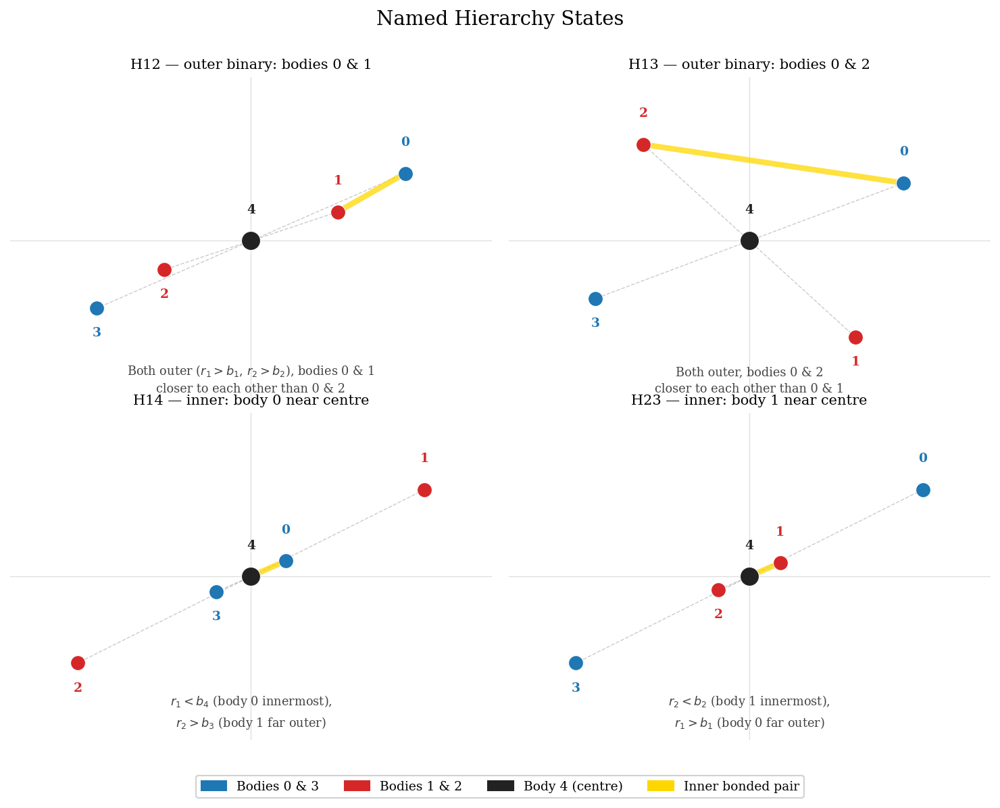
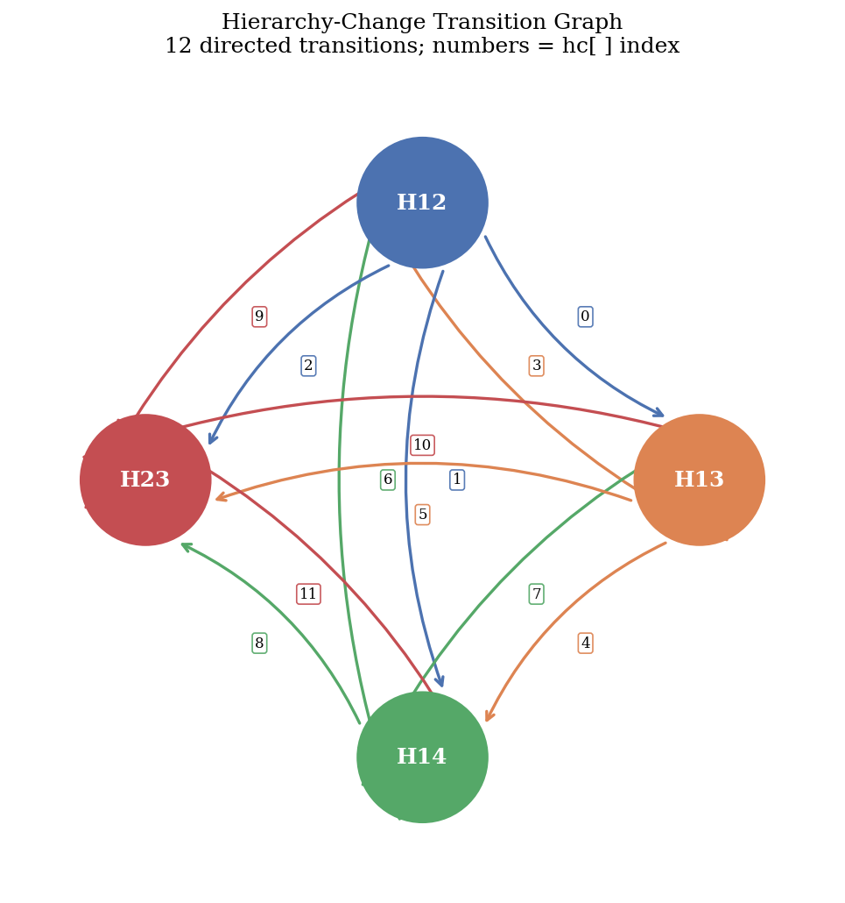
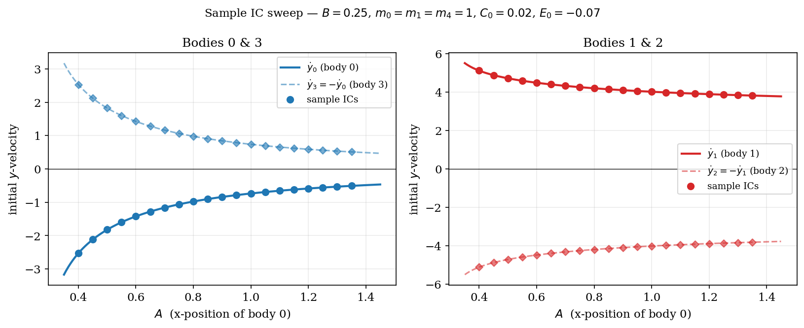
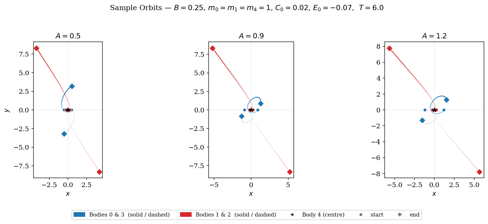
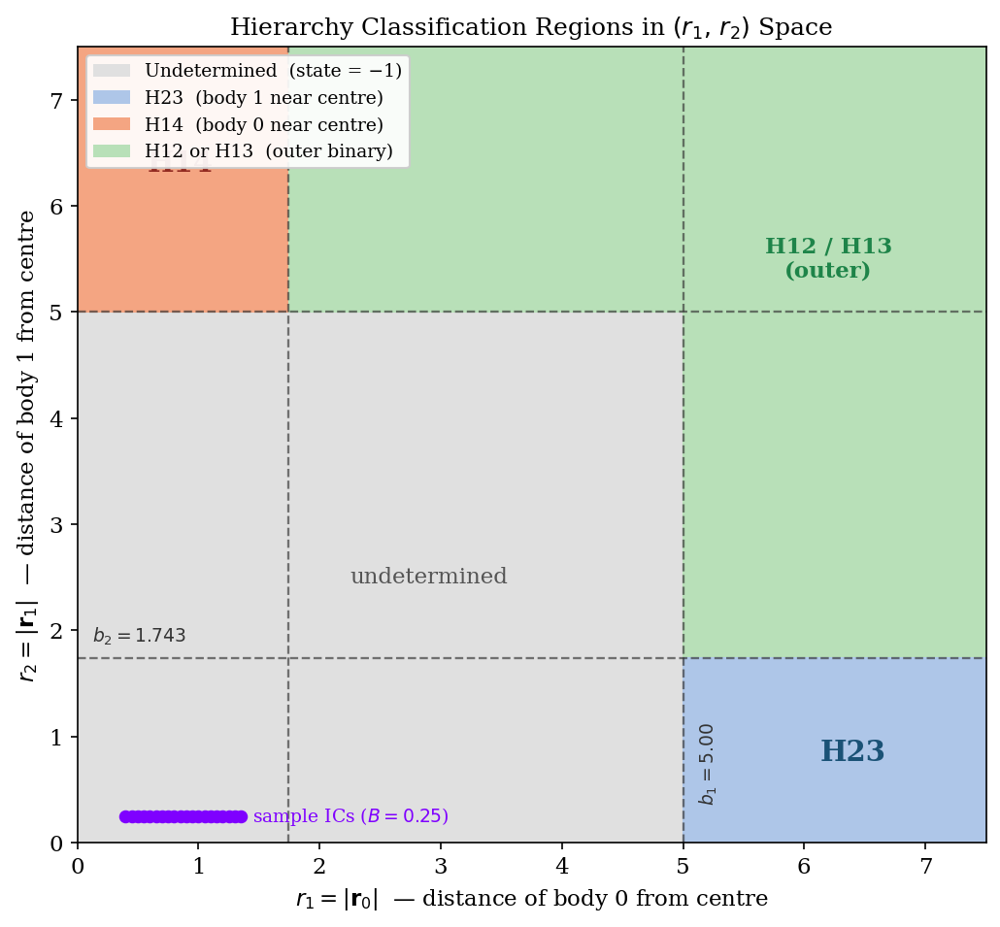
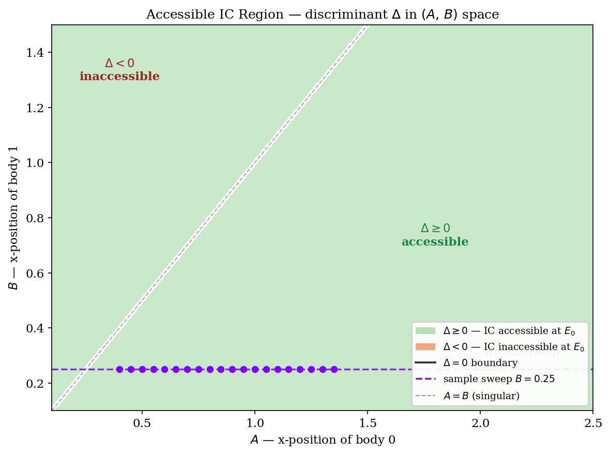
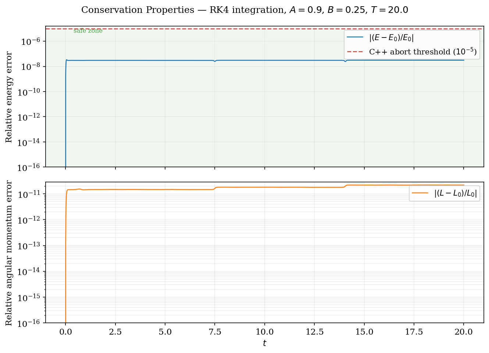

# Five-Body Hierarchical Stability Analyser — Modern C++17

A clean C++17 reimplementation of the planar five-body hierarchical stability
analyser. Given an ensemble of initial conditions it numerically integrates each
configuration using the Everhart RA15 method, enforces C₂ rotational symmetry at
every step, classifies the instantaneous hierarchy state, and records all
directed hierarchy transitions.

---

## Table of Contents

1. [Physical Setup](#1-physical-setup)
2. [Equations of Motion](#2-equations-of-motion)
3. [C₂ Symmetry Constraint](#3-c₂-symmetry-constraint)
4. [Initial-Condition Construction](#4-initial-condition-construction)
5. [Hierarchy Classification](#5-hierarchy-classification)
6. [Hierarchy-Change Index Map](#6-hierarchy-change-index-map)
7. [The RA15 Integrator](#7-the-ra15-integrator)
8. [Energy Conservation Check](#8-energy-conservation-check)
9. [Batch Architecture](#9-batch-architecture)
10. [File Formats](#10-file-formats)
11. [Building](#11-building)
12. [Running](#12-running)
13. [Output Interpretation](#13-output-interpretation)
14. [Repository Structure](#14-repository-structure)

---

## 1. Physical Setup

Five point masses move in a plane under mutual Newtonian gravity (G = 1).
The configuration has C₂ rotational symmetry: a 180° rotation about the origin
maps the system to itself.

| Body | Symbol | Initial x-position | Mass   |
|------|--------|--------------------|--------|
| 0    | —      | +A                 | m₀     |
| 1    | —      | +B                 | m₁     |
| 2    | —      | −B                 | m₁     |
| 3    | —      | −A                 | m₀     |
| 4    | centre | 0                  | m₄     |

Bodies 0 & 3 are a symmetric pair; bodies 1 & 2 are a symmetric pair; body 4 is
fixed at the origin by the symmetry. All bodies start on the x-axis with zero
x-velocity; y-velocities are derived from the energy and angular-momentum
constraints (§4).

---

## 2. Equations of Motion

Each body n satisfies Newton's law with total energy fixed at E₀ = −0.07:

```
ẍₙ = Σ_{l≠n} mₗ (xₗ − xₙ) / |rₙₗ|³
ÿₙ = Σ_{l≠n} mₗ (yₗ − yₙ) / |rₙₗ|³
```

where |rₙₗ| = √((xₙ−xₗ)² + (yₙ−yₗ)²).

The gravitational potential (summed over all C(5,2) = 10 pairs) is:

```
U = Σ_{n<l} mₙ mₗ / |rₙₗ|
```

Total energy:

```
E = ½ Σₙ mₙ (ẋₙ² + ẏₙ²) − U
```

---

## 3. C₂ Symmetry Constraint

When m₂ = m₁ and m₃ = m₀, the C₂ rotation r → −r is a **dynamical invariant**:
if the state is C₂-symmetric at t = 0, the equations of motion preserve it
exactly for all t. This can be verified by noting that under r → −r the force on
body n equals minus the force on body n's symmetry partner, so the acceleration
field is antisymmetric.

In practice floating-point errors break the symmetry slowly. After every RA15
call the symmetry is **enforced numerically** ("rest2" variant):

```
body 2 ← −body 1       body 3 ← −body 0       body 4 ← origin
```

i.e.

```
(x₂, y₂) = −(x₁, y₁)      (ẋ₂, ẏ₂) = −(ẋ₁, ẏ₁)
(x₃, y₃) = −(x₀, y₀)      (ẋ₃, ẏ₃) = −(ẋ₀, ẏ₀)
(x₄, y₄) = (0, 0)          (ẋ₄, ẏ₄) = (0, 0)
```

This reduces the system to 4 independent degrees of freedom: (x₀, y₀, x₁, y₁).

---

## 4. Initial-Condition Construction

**Given:** A, B, m₀, m₁, m₄, C₀

**Step 1 — Angular momentum parameter**

The angular-momentum magnitude is set from the dimensionless parameter C₀:

```
c = √(C₀ / |E₀|)
```

**Step 2 — Starting positions (on the x-axis)**

```
r₀ = (A, 0)    r₁ = (B, 0)    r₂ = (−B, 0)    r₃ = (−A, 0)    r₄ = (0, 0)
```

**Step 3 — Potential at the start**

```
U = Σ_{n<l} mₙ mₗ / |rₙₗ|
```

evaluated at the starting positions.

**Step 4 — Discriminant check**

The two constraints — angular momentum L = c and total energy E = E₀ — give a
quadratic in vᵧ₀. Its discriminant is:

```
Δ = −c² + 4 (A² m₀ + B² m₁)(E₀ + U)
```

If Δ < 0 the configuration is energetically inaccessible at E₀ and the row is
skipped (flag = −9999).

**Step 5 — Initial y-velocities**

```
vᵧ₀ = (A c m₀ − B √(m₀ m₁ Δ)) / (2 m₀² A² + 2 m₁ m₀ B²)

vᵧ₁ = (B c m₁ + A √(m₀ m₁ Δ)) / (2 m₀ m₁ A² + 2 m₁² B²)
```

**Step 6 — Symmetry partners**

```
vᵧ₂ = −vᵧ₁      vᵧ₃ = −vᵧ₀      vᵧ₄ = 0
```

All x-velocities are zero.

---

## 5. Hierarchy Classification

At each timestep the instantaneous configuration is classified into one of four
**named hierarchy states** based on four distances:

| Distance | Definition |
|----------|-----------|
| r₁  | \|r₀\| — distance of body 0 from origin |
| r₂  | \|r₁\| — distance of body 1 from origin |
| r₁₂ | \|r₀ − r₁\| — separation of bodies 0 and 1 |
| r₁₃ | \|r₀ + r₁\| — separation of bodies 0 and 2 (= \|r₀ − r₂\| by C₂) |

The boundaries b₁ … b₄ are read from the boundary file and scaled by 1/|E₀|
inside the code.

| State | Condition | Meaning |
|-------|-----------|---------|
| **H23** | r₂ < b₂ and r₁ > b₁ | Body 1 is innermost; body 0 is the outer intruder |
| **H14** | r₁ < b₄ and r₂ > b₃ | Body 0 is innermost; body 1 is the outer intruder |
| **H12** | outer zone and r₁₂ < r₁₃ | Bodies 0 & 1 form the inner binary |
| **H13** | outer zone and r₁₂ > r₁₃ | Bodies 0 & 2 form the inner binary |
| **−1** | none of the above | Undetermined / transition zone |

---

## 6. Hierarchy-Change Index Map

Every directed transition between named states increments one of 12 counters
written to the output (columns `hc12-13` … `hc23-14`):

| Index | hc[] | Transition |
|-------|------|-----------|
| 0  | hc[0]  | H12 → H13 |
| 1  | hc[1]  | H12 → H14 |
| 2  | hc[2]  | H12 → H23 |
| 3  | hc[3]  | H13 → H12 |
| 4  | hc[4]  | H13 → H14 |
| 5  | hc[5]  | H13 → H23 |
| 6  | hc[6]  | H14 → H12 |
| 7  | hc[7]  | H14 → H13 |
| 8  | hc[8]  | H14 → H23 |
| 9  | hc[9]  | H23 → H12 |
| 10 | hc[10] | H23 → H13 |
| 11 | hc[11] | H23 → H14 |

Transitions through the undetermined zone (state = −1) are not counted; the
previous named state is held until the next named state is reached.

---

## 7. The RA15 Integrator

Integration uses the **Everhart RA15** method: a 15th-order Gauss-Radau
predictor-corrector designed for conservative N-body problems.

Key settings:

| Parameter | Value | Meaning |
|-----------|-------|---------|
| `NV`      | 10    | Equations: 5 bodies × 2 coordinates |
| `LL`      | 8     | Accuracy: sequence error target 10⁻⁸ |
| `NCLASS`  | −2    | ODE type: y″ = F(y) (no velocity dependence) |
| `TIMESTEP`| 0.001 | Integration sub-interval per call |

`RA15.cpp` is fully NV-agnostic. The same file is used unchanged in both the
four-body and five-body projects.

---

## 8. Energy Conservation Check

After every RA15 call the relative energy error is tested:

```
|( E − E₀ ) / E₀| > 10⁻⁵  →  abort, flag = −999
```

This catches numerical blow-up from close encounters or excessively large steps.

---

## 9. Batch Architecture

```
filenames.txt
    │
    ├── nFiles, nIC, nSteps
    └── for each file triplet:
            boundary file  ──►  scale thresholds by 1/|E₀|
            IC file        ──►  read rows, skip # comments
            output file    ──►  write header + one row per IC
```

**Resume support:** on startup `findStart()` scans existing output files and
counts completed rows. The batch continues from the last incomplete file and row,
appending rather than overwriting.

**Progress reporting:** a running counter is printed to stdout every 100 ICs.

---

## 10. File Formats

### `filenames.txt`

```
<nFiles>
<nIC>  <nSteps>
<boundary_file>  <ic_file>  <output_file>
...  (one triplet per file)
```

Example:
```
1
20 1000
data/b_default.txt data/ic_sample.txt data/out_sample.txt
```

### Boundary file (`b_default.txt`)

One line with four space-separated values (unscaled; the code multiplies by
1/|E₀| = 1/0.07 ≈ 14.286):

```
b1  b2  b3  b4
```

Example — `0.35 0.122 0.35 0.122` → effective thresholds ≈ 5.0, 1.743, 5.0, 1.743.

### IC file

Lines beginning with `#` are comments and are ignored. Each data line has
eight columns:

```
A   unused   unused   B   m0   m1   m4   C0
```

| Column | Meaning |
|--------|---------|
| A      | x-position of body 0 (+A); body 3 placed at −A |
| B      | x-position of body 1 (+B); body 2 placed at −B |
| m0     | mass of bodies 0 and 3 |
| m1     | mass of bodies 1 and 2 |
| m4     | mass of central body (body 4) |
| C0     | dimensionless angular-momentum parameter |

The two "unused" columns are read and discarded (legacy format compatibility).

### Output file

Header line followed by one row per IC:

```
# A B flag hc12-13 hc12-14 hc12-23 hc13-12 hc13-14 hc13-23 hc14-12 hc14-13 hc14-23 hc23-12 hc23-13 hc23-14 t12 t13 t14 t23 xf0 yf0 xf1 yf1
```

| Column | Meaning |
|--------|---------|
| A, B   | Input parameters |
| flag   | 0 stable \| 1 symmetry-breaking unstable \| −999 energy failure \| −9999 inaccessible IC |
| hc12-13 … hc23-14 | 12 directed transition counters (see §6) |
| t12 … t23 | Total time spent in each hierarchy state |
| xf0 yf0 xf1 yf1 | Final positions of bodies 0 and 1 |

---

## 11. Building

**Requirements:** Visual Studio 2022 (any edition), x64 toolset (v143).

Open `FiveBodyHierarchy.sln` and build **Release | x64**. The solution contains
two projects:

| Project    | Type          | Output |
|------------|---------------|--------|
| Integrator | Static library | `x64/Release/Integrator.lib` |
| FiveBody   | Console app    | `x64/Release/FiveBody.exe`   |

`FiveBody` links `Integrator` automatically via the project reference.

**CI:** GitHub Actions runs `build.yml` on every push to `main`. It builds
Release|x64 with MSBuild, runs the executable against the sample data, and
uploads `out_sample.txt` as an artifact.

---

## 12. Running

```
cd FiveBody
..\x64\Release\FiveBody.exe data\filenames.txt
```

The path to `filenames.txt` is the only argument (defaults to
`data/filenames.txt` if omitted). All other paths in `filenames.txt` are
relative to the working directory, so run from the `FiveBody\` folder.

**Resuming an interrupted run:** simply re-run the same command. `findStart()`
detects how many rows were already written and continues from that point.

---

## 13. Output Interpretation

- **flag = 0, all hc = 0:** The system remained in the undetermined zone for
  the entire integration. This happens when A and B are small relative to the
  effective boundaries (b₁_eff = b₁/|E₀|). Increase A, B or the integration
  time to see transitions.
- **flag = −999:** A close encounter drove the energy error above 10⁻⁵. Reduce
  `TIMESTEP` or `E0_FIXED` to explore this region.
- **flag = −9999:** The discriminant Δ < 0 — the requested (A, B, C₀)
  combination has no real velocity solution at E₀ = −0.07. Try a smaller C₀ or
  a different A/B ratio.
- **Non-zero hc counters:** The hierarchy changed state during the run. Summing
  all 12 counters gives the total number of transitions; asymmetries between
  forward and reverse transitions indicate a tendency toward one hierarchy.

---

## 14. Repository Structure

```
FiveBodyHierarchy_Modern/
├── FiveBodyHierarchy.sln          VS2022 solution
├── .gitignore
├── .github/
│   └── workflows/
│       └── build.yml              GitHub Actions CI
├── Integrator/                    Static library
│   ├── Integrator.vcxproj
│   ├── include/
│   │   ├── Force.h                computeForce() declaration
│   │   └── RA15.h                 ra15() declaration + ForceFunc typedef
│   └── src/
│       ├── Force.cpp              5-body pairwise accelerations (10 pairs)
│       └── RA15.cpp               Everhart RA15 (NV-agnostic)
└── FiveBody/                      Console application
    ├── FiveBody.vcxproj
    ├── src/
    │   └── main.cpp               Batch driver + IC setup + hierarchy analysis
    └── data/
        ├── filenames.txt          Run configuration
        ├── b_default.txt          Hierarchy boundary parameters
        ├── ic_sample.txt          20 sample initial conditions
        └── out_sample.txt         Sample output (generated; not tracked by git)
```

---

## Diagrams

### C₂-Symmetric Body Configuration

Initial placement of all five bodies on the x-axis. Bodies 0 & 3 (blue) form one
symmetric pair at ±A; bodies 1 & 2 (red) form the inner pair at ±B; body 4 (black)
is fixed at the origin. Arrows show the initial y-velocities derived from the
energy and angular-momentum constraints.



---

### Named Hierarchy States

Schematic of the four named states a configuration can occupy. The gold bar
highlights the bonded inner pair. Dashed lines connect C₂ mirror partners.



---

### Hierarchy-Change Transition Graph

All 12 directed transitions among the four named states. Each arrow is labelled
with its `hc[]` index as written to the output file (see §6 of the README above).



---

### Initial Y-Velocities Across the Sample Sweep

Analytically derived initial y-velocities as a function of A for the sample
parameter sweep (B = 0.25, m₀ = m₁ = m₄ = 1, C₀ = 0.02, E₀ = −0.07).
Solid lines = continuous curve; filled circles = the 20 sample IC rows.



---

### Sample Orbit Trajectories

Numerically integrated orbits for three representative initial conditions
(A = 0.50, 0.90, 1.20; B = 0.25; T = 6). Solid lines follow bodies 0 & 1;
dashed lines are their C₂ mirror partners (bodies 3 & 2). Trail intensity
fades from early (pale) to late (vivid). Open circles = start; diamonds = end.



---

### Hierarchy Classification Map

Every point in (r₁, r₂) space is coloured by the hierarchy state returned
by `identifyHierarchy()`. The dashed lines mark the effective boundary
thresholds (b₁ ≈ 5.00, b₂ ≈ 1.74) scaled from `b_default.txt` by 1/|E₀|.
Purple dots show where the 20 sample ICs start (r₁ = A, r₂ = B = 0.25).



---

### Accessible IC Parameter Space

Green region: discriminant Δ ≥ 0 — a real initial-velocity solution exists
at E₀ = −0.07. Red region: Δ < 0 — the IC is energetically inaccessible and
is skipped with flag = −9999. The purple dashed line is the sample sweep
(B = 0.25, A from 0.40 to 1.35), which lies entirely in the accessible region.



---

### Energy and Angular Momentum Conservation

Relative errors in total energy E and angular momentum L along a single
RK4-integrated trajectory (A = 0.90, T = 20). Both are conserved to better
than 10⁻¹⁰ — well below the 10⁻⁵ abort threshold enforced in the C++ code.
The shaded green band marks the "safe zone" below the abort threshold.



---

## Legacy Reference

The original FORTRAN/MFC implementation is preserved at
[ra15-C--fivebody-hierarchy-legacy](https://github.com/drmshoaib/ra15-C--fivebody-hierarchy-legacy).
That repository includes a detailed README covering the original code's known
limitations (32-bit only, MFC dependency, F(8) array bug, deprecated I/O).
